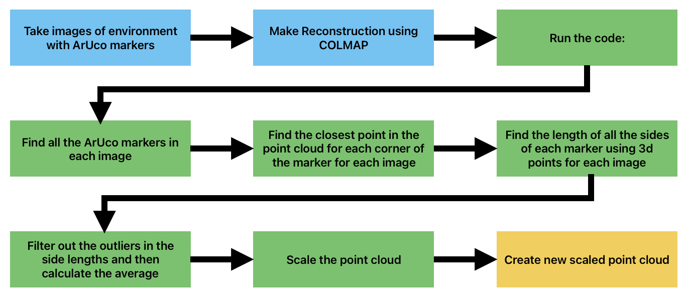
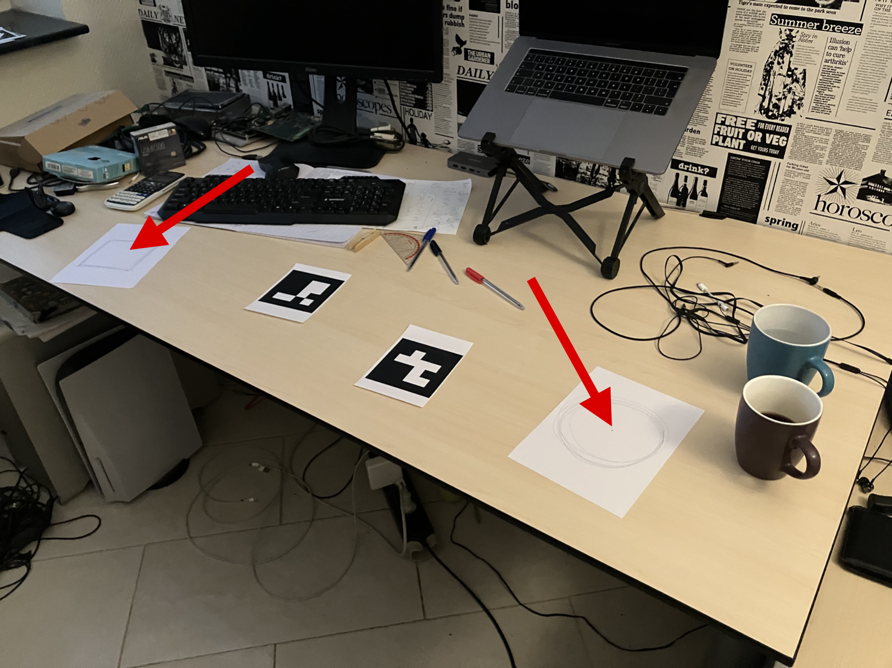
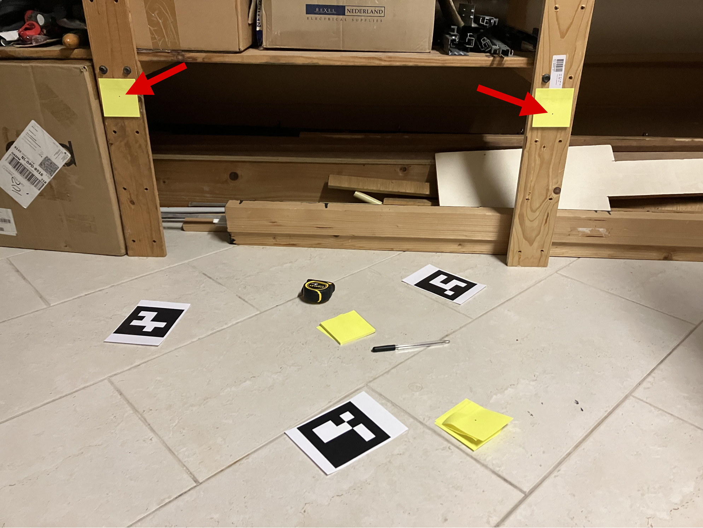

# ArUco-COLMAP-point-cloud-scaling
Automated Metric Scaling for 3D Point Clouds made with COLMAP.

##PROJECT OVERVIEW
The goal of this project is to accuratly scale a COLMAP pointcloud using DICT_4X4_50 ArUco markers. The scene that is photographed should have one or multiple markers with the same size in it, with a known size. These markers will be used to scale the pointcloud.

###How to run:
libraries/frameworks:
- it was made on Ubuntu 24.04
- COLMAP, it needs to be compiled from scratch to acces the COLMAP libraries
- OpenCV 4.6.0

1. In main.cpp change the variable "sizeOfMarker" to the length of the sides of the marker in meters.
2. Compile the code, in the project folder: "cmake --build build/"
3. After having run a COLMAP reconstrution, copy the "sparse" folder into the project folder.
4. Add the images that were used for the reconstrution to the folder: "images", the images have to be .JPG, .jpg or .png. Make sure only images are in this folder.
5. Run the C++ code by: "./build/my_app"
6. The scaled pointcloud is now stored in the "model_scaled" folder.

ADD EXAMPLE VIDEO

##SCENE DESCRIPTION AND DATA COLLECTION
This project was made with markers of size 0.099x0.099 meter. It can also work with larger and smaller markers. In order for the COLMAP to make a good pointcloud there needs to be a lot of details in the environment.
Make sure that the markers are clearly visible in multiple images. Not every marker has to be in every image, but make sure that each individual marker is clearly visible in at least 3 images.
Also make sure to add some closeup images of each individual marker. The pointcloud of the ArUco markers needs to be very detailed in order for the scalefactor to be accurate.

##HOW THE CODE WORKS
So once the COLMAP pointcloud has been made the following will be done:

The code loops through all the images and looks for the ArUco markers. It stores for each marker the data in a struct. The data that is stored is: the id of the marker, the name of the image file and the coordinates of the corners of the marker.
Parallel processing is used to speed up this process.

The code will then loop through the data in the struct to find the 3d coordinates for each corner for each detected marker in each image. So each marker will be assigned multiple sets of 3d coordinates, using each image that was used to detect it.
It does this by putting the 3d pointcloud points onto the image and looking which of these points is the closest to each corner of each marker. The 3d point that is closest is then stored in the struct.

Then for each marker in each image, the lenth of all the sides of each marker is calculated using the 3d coordinates that are projected onto that image. The average side length will be calculated using the closest 3d points. This is the average side length of the unscaled pointcloud.
In this average some outliers are taken into account, which make the scale factor less accurate. To deal with this, forst the average with the outliers is calculated then the outliers are filtered out by removing every measurement that deviates more than 30% from the average. Then the average is calculated without the outliers.

Since the real side length is known the scale factor can be calculated. This scale factor is used scale the pointcloud, which is stored in a folder named: "model_scaled".

##RESULTS
To measure how accurate the pointcloud is, 3 setups will be used. In each setup there will be 2 points of which the exact distance is known. The accuracy defined using error margin. the relative error in each setup will be calculated as: ( measured_distance / actual_distance ) / actual_distance.
The objects used to measure the distance of, are points on pieces of paper. These points have a circumference of about 1 to 2 mm. This is big enough to affect the error margin of a small distance, so the points will be placed pretty far away from each other (about 1 meter).
I will use the COLMAP gui to find the ID of the points I am measuring and then use the python code: "distancePointsByID.py" to find the scaled distance.

###SETUP 1: A desk with 2 markers. Everything is laid flat on the desk.

###SETUP 2: A kitchen with 2 measurement points and a ArUco on the floor and 2 ArUco markers on the wall.

###SETUP 3: A garage where the measurement points are placed on a wall and 3 ArUco markers are placed on the floor.

The following table has the measurement accuracy for the three different environments.

| Setup | Actual Distance | Measured Distance | Relative Error |
| :--- |  :---: | :---: | :---: |
| **Setup 1** | 0.9 m | 0.9148 m | 1.64% |
| **Setup 2** | 1.5 m | 1.5424 m | 2.83% |
| **Setup 3** | 0.9 m | 0.9164 m | 1.82% |

##FUTURE IMPROVEMENTS

